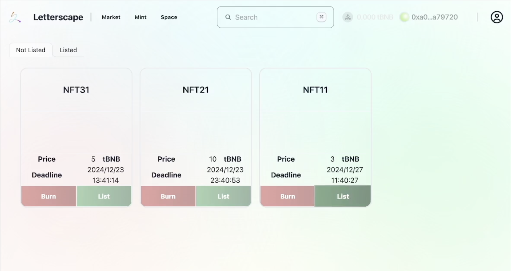

# letterscape
## One liner

  Our project addresses the efficiency of propagation and imbalance income for creators through NFTnomics and help user to screen out valuable contents

## Value proposition

  Make creator's production investable

## Detail

  Vision: Our project devotes to resolve the most crucial and fundamental problem in creator economy: imbalance resource distribution for creators. Our project provide a way of NFTnomics to address the problem.

  In our project, creators can create and publish their productions(now only text supported, but vedio and audio will be supported in the future). **This is where innovation comes in and different from other content platforms**: Once creators product their contents, the entire page of their productions (not only the contents created in this project, but also created in other project) will be regarded as the assets of the creators. Then creators can mint part of their production page (not just the production itself) to different kinds of NFTs for different functions and list them to the market. 

  **It should be noted that** the people who want to make money can **earn profits** like investing from here, because if an unknown creator producted a valuable content, then people can buy some NFTs of the content in low cost, and make efforts to help creator to propagandize the production to increase its exposure, as the exposure goes up, so does the user traffic and attentions, finally the brand parties would buy NFTs to promote their productions in a relative high price. Profits are made now. And the people ,who wants to find out **high valued** contents, just screens out by the price of NFT. It's much easier than before, and people won't be deceived, because sometimes traffic can be fraud.

  **High fluidity** NFT: Different from existing NFT, in our project, we use Harberger Tax , an economic concept put forward by Arnold Harberger, which can allocate resource in an efficient way to make NFTs flow to the people who can use them for the most value in an unblocked and efficient way.

  The logic of  NFT transaction: 

  1. Anyone, usually the creator, mints a NFT, should set a price expected to sell and interval for calculating the deadline as well.
  2. Anyone who wants to pay the sale price can buy the NFT playing by heart, and set a expected sale price.
  3. Anyone except creator holds NFT should pay a hold fee before the deadline, otherwise NFT will be burnt.
  4. After NFT burnt, anyone can mint again, and anyone except creator mints a NFT existed before should pay a mint fee.

  For creator: Once creators mint NFT for their productions, every time NFT sold, creators will receive an income from positive price difference.

  For user: Find high valued content will get much easier. Or buy on the low price, then sharing and promoting or doing nothing just waiting, finally sell on the high price to the brand parties or others and earn a margin.

## demo vedio: https://youtu.be/oeChQCEGRsc

## screenshots

